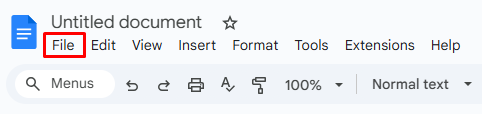
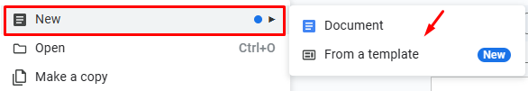

**To create a document from the File menu**:

1. Open your document in Google Docs. 
1. Click **File** in the menu.  

3. Click  **New** to choose the type of a new document: 

- Click  **Document** to open a blank document.
- Click  **From a template** to choose the necessary type of the template. 

Your document is created. 