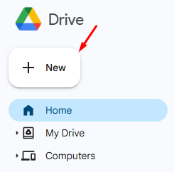
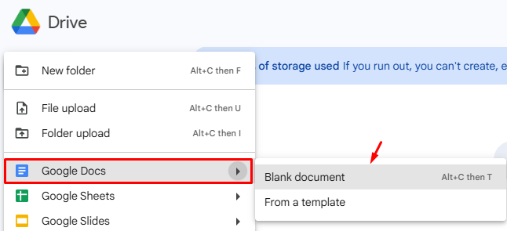

**To create a document from Google Drive**:

 1. Open the Google Drive homepage [(https://drive.google.com/)](https://drive.google.com/).
 2. Click + **New**.

3. Click  **Google Docs** to choose the type of a new document:

- Click **Blank document** to open a document.
- Click **From a template** to select the necessary type of the template.

Your document is created.  
  

