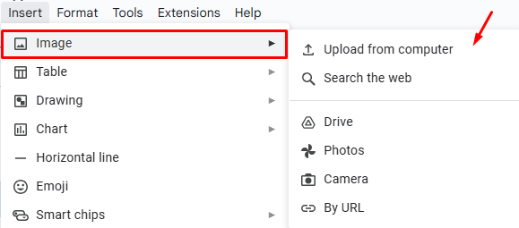

**To insert an image in Google Docs**: 

1. Click **Insert** in the menu.

2. Click  **Image**. Then choose the necessary option for inserting your image. 

Your image is inserted into your document. 