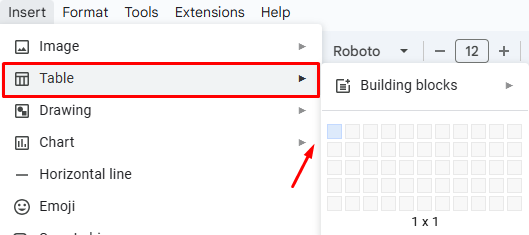
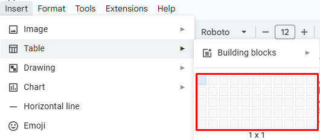

**To insert a table in Google Docs**:

1. Click **Insert** in the menu. 

2. Click  **Table** to choose the necessary options for your table:

- Click **Building blocks** to choose the necessary layout in the list.

- Click the necessary number of rows and columns for your table. 

Your table is inserted into the document. 

